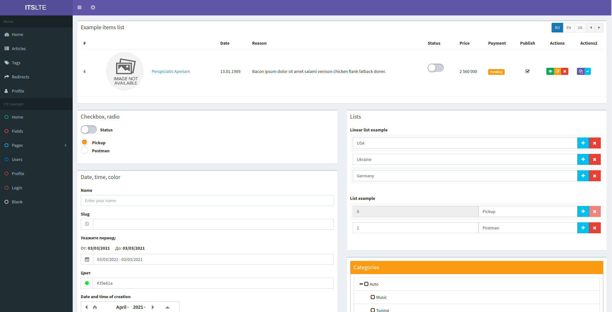

# Laravel ITS LTE

[](https://packagist.org/packages/fomvasss/laravel-its-lte)
[](https://github.com/fomvasss/laravel-its-lte)
[](https://packagist.org/packages/fomvasss/laravel-its-lte)
[](https://packagist.org/packages/fomvasss/laravel-its-lte)
[](https://scrutinizer-ci.com/g/fomvasss/laravel-its-lte)

Base Admin LTE Control Panel Templates



----------

## Installation

Run from the command line:

```bash
composer require fomvasss/laravel-its-lte
```

```bash
php artisan lte:install
```

That's all. You can usage ITS LTE in your project :) 

Visit the path `http://your-site.local/lte` 


## Publishing (optional)
Of course, you can publish only the necessary system components:
- views:
`lte-view-fields`, `lte-view-content`, `lte-view-auth`, `lte-view-parts`, `lte-view-layouts`, `lte-view-profile`
- other:
`lte-config`, `lte-assets`, `lte-lang`

```bash
php artisan lte:publish --tag=lte-view-fields --force
```
or all components
```bash
php artisan lte:publish
```

### Updating 
When updating this package, you should re-publish the assets (css, js, images):
```bash
php artisan lte:publish --tag=lte-assets --force
```

## Configuration

After publishing assets, its primary configuration file will be located at `config/its-lte.php`
```php
<?php

return [

    'title' => env('APP_NAME', '') . ' - Dashboard',

    'logo' => env('LTE_LOGO', '<b>ITS</b>LTE'),

    'logo_mini' => env('LTE_LOGO_MINI', '<b>IT</b>LT'),

    /*
     * Dashboard home page path
     */
    'logo_href' => '/lte',

    /*
     * For example pages
     */
    'prefix' => 'lte',

    /*
     * For /profile page
     */
    'use_laravel_fortify' => true,

    /*
     * For LTE example pages (/lte/*)
     */
    'middleware' => ['web'],

    /**
     * Use in Fomvasss\ItsLte\Http\Middleware\ApplyRequestOptions
     */
    'control' => [
        'next_destination_key' => 'destination',
    ],

    'view' => [

        /**
         * Available skins:
         * skin-blue, skin-black, skin-purple, skin-green, skin-red,
         * skin-yellow, skin-blue-light, skin-black-light, skin-purple-light,
         * skin-green-light, skin-red-light, skin-yellow-light,
         *
         */
        'skin' => 'skin-purple',
        'layout_boxed' => false,
        'sidebar_collapse' => false,
        'fixed' => false,

        /**
         * Show next type alerts in dashboard
         * Example success type alert: \Session::flash('success', 'Welcome to Laravel Admin LTE!');
         * Available types: success, info, warning, error
         *
         */
        'alerts' => [
            'toastr',
            //'sweetalert',
            //'bootstrap',
        ],

        'btn_actions_class' => 'btn-xs', //'btn-sm btn-flat'

        /**
         * Example aside menu
         */
        'aside_menu' => [
            'static' => false,
            'static_example' => env('APP_ENV') !== 'production',
            'lte' => env('APP_ENV') !== 'production',
        ],

        'aside_auth_user_info' => false,

        'aside_search' => false,

        'header_filter_languages' => true,

        'header_notify_menus' => true,
    ],
];
```

In dashboard used Bootstrap styles and for correct show pagination links, set next in service provider
```
    public function boot()
    {
        //...
        Paginator::useBootstrap();
        //...
    }
```

For correct work navigation in dashboard, apply next middleware for routes to dashboard:
```
\Fomvasss\ItsLte\Http\Middleware\ApplyRequestOptions::class,
```

## Structure

After installation, you can work with the following files:

- `config/its-lte.php` - configs
- `public/vendor/its-lte` - compiled assets files
- `resources/lang/vendor/lte` - message localization files
- `resources/views/vendor/lte`
    - `layouts` - main layout
    - `parts` - not published by default
    - `fields` - not published by default
    - `auth` - auth/register/reset forms
    - `content` - example templates for content
    - `profile` - auth user profile form

### Laravel File Manager (v2)   
If needed, install [LFM](https://github.com/UniSharp/laravel-filemanager):

```bash
composer require unisharp/laravel-filemanager
```

Publish LFM files:
- `config/lfm.php`
- `public/vendor/laravel-filemanager`
Recommend set LFM paths `config/lfm.php`:
```php
    'shared_folder_name' => 'shares',
    //...
    'folder_categories' => [
        'file' => [
            'folder_name' => 'lfm-files',
            //...
        ],
        'image' => [
            'folder_name' => 'lfm-photos',
            //...
        ],      
    ],
```

## Usage

In dir `resources/views/vendor/lte` you can edit, create, delete blade-files.

For simple manage file-fields use [fomvasss/laravel-medialibrary-extension](https://github.com/fomvasss/laravel-medialibrary-extension)

## Credits
- [web-west/itslte](https://github.com/web-west/itslte)
- [ColorlibHQ/AdminLTE](https://github.com/ColorlibHQ/AdminLTE)
- [laravel-filemanager](https://unisharp.github.io/laravel-filemanager/)